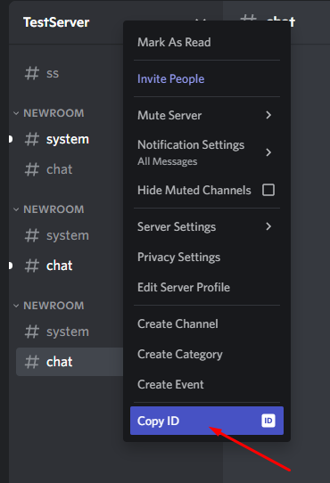
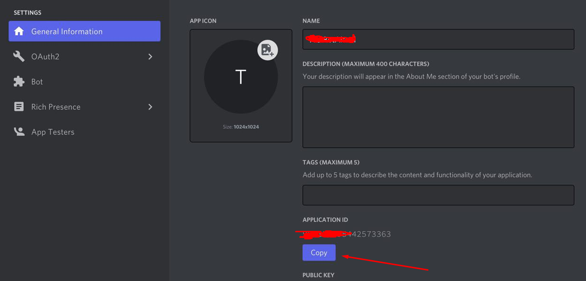
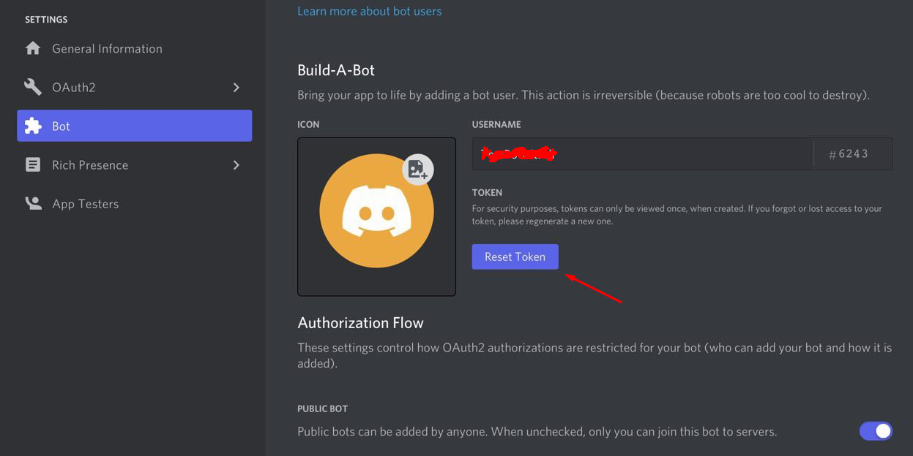

# Environment variables

You need to provide 3 environment variables to make the bot function properly:
The best way to do it is by creating a file *.env* in the root directory of the project
and replacing these values with yours.

```console
CLIENT_ID=[CLIENT_ID]
DISCORD_TOKEN=[DISCORD_TOKEN]
GUILD_ID=[GUILD_ID]
```

## How to obtain ?

* Go to your server in discord and right click on it, then copy your [GUILD_ID].



* Go to [developers portal](https://discord.com/developers/applications)

* Go to **General information** tab. Copy your [CLIENT_ID].



* Go to **Bot** tab. Reset your [DISCORD_TOKEN] and copy it.

